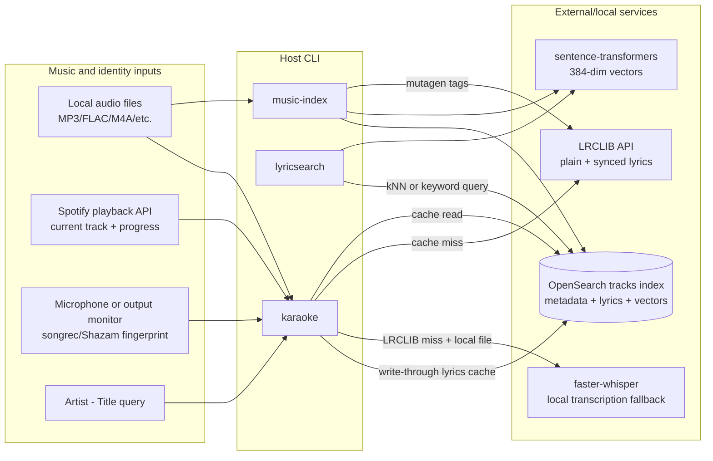
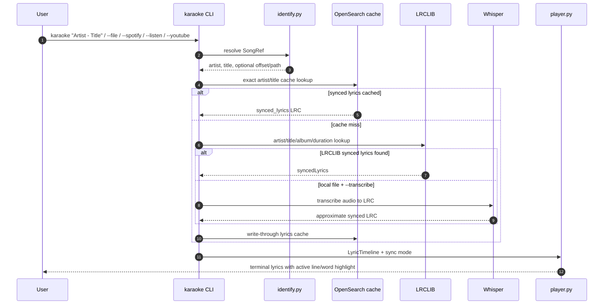
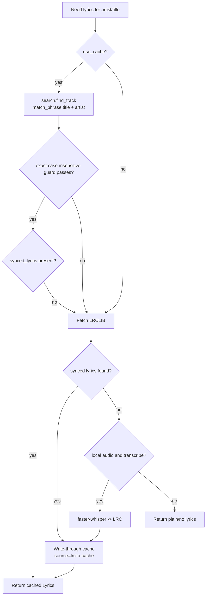
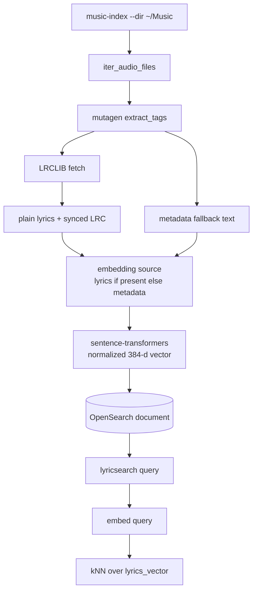
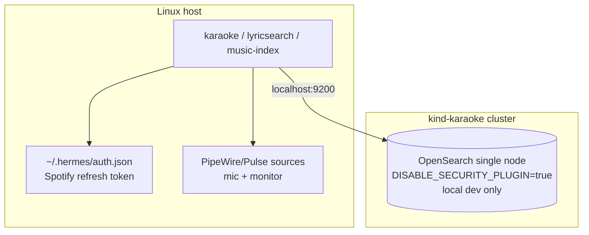

# Architecture

Karaoke has three planes: data, ingest and client runtime.

## Runtime components

| Module | Responsibility |
| --- | --- |
| `config` | Loads environment configuration and `.env` defaults. |
| `tags` | Extracts audio metadata using mutagen. |
| `lyrics` | Fetches LRCLIB lyrics and parses LRC timestamps. |
| `scanner` | Walks local music files and builds OpenSearch documents. |
| `spotify_import` | Converts Spotify library exports/API objects into metadata documents. |
| `embed` | Lazily loads the sentence-transformer model and creates normalized vectors. |
| `osclient` | Creates the OpenSearch client and ensures the `tracks` index/mapping exists. |
| `search` | Runs semantic, keyword and exact cache lookups. |
| `localcache` | Cluster-independent SQLite lyrics cache + play/discovery stats. |
| `identify` | Resolves songs from files, queries or live songrec matches. |
| `youtube` | Resolves a SongRef from a YouTube URL (yt-dlp metadata + smart title parser). |
| `whisper_sync` | Transcribes local audio into approximate LRC when LRCLIB has no synced lyrics. |
| `player` | Converts lyrics to timelines and renders Rich terminal karaoke views. |
| `beats` | Optional beat detection and fallback lyric-line pulse logic. |
| `sentiment` | Lightweight lyric mood classification for renderer tinting. |
| `cli` | Console entrypoints: `karaoke`, `lyricsearch`, `music-index`. |

## Main playback flow

## Cache-first lyrics lookup

The cache is deliberately conservative: exact artist/title matching is used for lyrics lookup so a fuzzy OpenSearch match cannot return the wrong song's lyrics.

## Live sync modes

| Mode | Position source | Re-lock behavior | Notes |
| --- | --- | --- | --- |
| File/text | User presses Enter at music start | None | Optional `--offset`; file mode can detect real beats. |
| Spotify | Spotify Web API `progress_ms` | Polls current playback; moves to next track automatically. | Does not download audio; lyrics are LRCLIB/cache only. |
| Listen/output | songrec match `offset` + `time.monotonic()` anchor | One-shot lock | `--lead` applies a default forward bias for recognition latency. |
| Radio | Repeated songrec matches | Re-anchors same track, swaps timeline on new track | Keeps rendering while speech/ad/quiet sections do not match. |
| YouTube | User presses Enter at music start | None | yt-dlp title → smart parse → LRCLIB; `--download` unlocks Whisper/beats and auto-prunes downloaded audio to `KARAOKE_YT_CACHE_MAX_MB`; `--cookies-from-browser`/`--cookies` authenticate for Premium-quality/library access. Live-position sync not available — use `--output`/`--radio` for that. |

## Ingest and semantic search flow

## Deployment boundary

OpenSearch runs locally on a kind cluster and is exposed to the host at `http://localhost:9200` by default. The CLI stays on the host, which keeps audio devices, Spotify credentials and terminal rendering outside Kubernetes.

