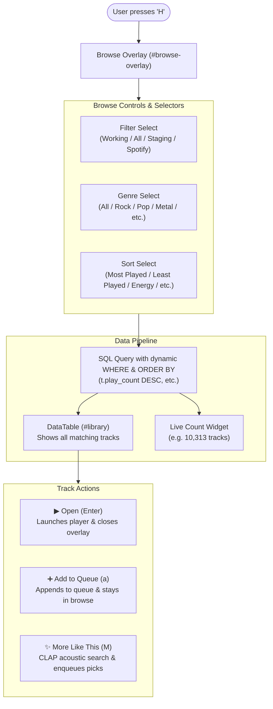

# Implementation Plan: Browse Mode ('H') Fixes & Enhancements

This plan addresses the bugs and feature gaps in Browse Mode (`H`) in the Karaoke TUI:
1. **Browse all songs**: Eliminating the artificial 70-item cap (`INITIAL_BROWSE_LIMIT = 70`) so users can browse all 10,000+ songs in their collection (with optional batch/all selection and live count).
2. **Genre filter in `H`**: Adding a synchronized genre selector to the browse overlay header (`#browse-head`).
3. **Play count sorting**: Pushing sort modes (`most_played`, `least_played`, `energy`, etc.) directly into the SQL query's `ORDER BY` clause so sorting operates globally across the entire database rather than merely re-ordering the first 70 alphabetical tracks.
4. **Option: Add to current queue**: Adding an explicit toolbar button (`➕ Add to Queue (a)`) and clear subtitle instructions so users can queue songs without closing the browse overlay.
5. **Option: Find more like this**: Adding an explicit toolbar button (`✨ More Like This (M)`) and keybinding to discover and queue acoustically similar tracks via CLAP / `sounds_like`.

---

## User Review Required

> [!IMPORTANT]
> **Browse Limit Strategy**:
> The library currently contains 18,169 total tracks (10,313 working tracks with lyrics).
> In performance tests, querying all 10,313 working tracks takes **0.337 seconds** in SQLite and populating the Textual `DataTable` takes **0.355 seconds** (total ~0.7 seconds).
> We propose:
> 1. Setting the default browse limit to **All tracks** (or 1,000 default with an instant limit selector `[500, 1000, 5000, All]`), while running the query with the active filter.
> 2. Adding a live count label (e.g. `Showing 10,313 tracks (Genre: Rock)`).
> 
> Please let us know if you prefer a strict limit selector or default to loading all matching tracks.

---

## Open Questions

- **Table Action on `Enter`**: Currently, pressing `Enter` immediately opens the track in the browser/kiosk player and closes the overlay. Pressing `a` or clicking `[➕ Add to Queue (a)]` keeps the overlay open and appends the song to the queue. Does this split meet your workflow expectations, or would you prefer an action modal when pressing `Enter`?

---

## Proposed Architecture & Workflow



---

## Proposed Changes

### Component: TUI Browse Overlay & Data Pipeline (`src/karaoke/tui.py`)

#### [MODIFY] [`src/karaoke/tui.py`](file:///home/tina/karaoke/src/karaoke/tui.py)

1. **Add Genre Filter to `#browse-head`**:
   - Add `Static("Genre", classes="browse-label")` and `Select(genre_filter_options(), value=self._genre_filter, id="browse-genre-select")`.
   - Update `on_select_changed` to keep `#genre-select` (sidebar) and `#browse-genre-select` (overlay) in sync.

2. **Add Action Toolbar & Live Track Count**:
   - In `#browse-overlay`, right beneath `#library` `DataTable`, add:
     ```python
     with Horizontal(id="browse-toolbar"):
         yield Button("▶ Open (Enter)", id="btn-browse-open", variant="primary")
         yield Button("➕ Add to Queue (a)", id="btn-browse-enqueue", variant="default")
         yield Button("✨ More Like This (M)", id="btn-browse-more", variant="default")
         yield Static("", id="browse-count")
     ```
   - Update `overlay.border_subtitle = "Enter open · a add to queue · M more like this · H close"`

3. **Wire Buttons in `on_button_pressed`**:
   - `btn-browse-open`: calls `self.action_select()`
   - `btn-browse-enqueue`: calls `self.action_enqueue_selected()`
   - `btn-browse-more`: calls `self.action_more_like_this()`

4. **Fix Global Sorting in `_load_tracks`**:
   - Replace hardcoded `ORDER BY t.artist, t.title LIMIT :browse_limit` with dynamic SQL ordering:
     ```python
     sort_mode = getattr(self, "_sort", "energy_desc")
     if sort_mode == "most_played":
         order_sql = "t.play_count DESC, t.artist COLLATE NOCASE, t.title COLLATE NOCASE"
     elif sort_mode == "least_played":
         order_sql = "t.play_count ASC, t.artist COLLATE NOCASE, t.title COLLATE NOCASE"
     elif sort_mode == "energy_desc":
         order_sql = "a.energy DESC NULLS LAST, a.bpm DESC NULLS LAST, t.artist COLLATE NOCASE, t.title COLLATE NOCASE"
     elif sort_mode == "energy_asc":
         order_sql = "a.energy ASC NULLS LAST, a.bpm ASC NULLS LAST, t.artist COLLATE NOCASE, t.title COLLATE NOCASE"
     elif sort_mode == "bpm_desc":
         order_sql = "a.bpm DESC NULLS LAST, t.artist COLLATE NOCASE, t.title COLLATE NOCASE"
     elif sort_mode == "bpm_asc":
         order_sql = "a.bpm ASC NULLS LAST, t.artist COLLATE NOCASE, t.title COLLATE NOCASE"
     elif sort_mode == "key":
         order_sql = "a.detected_key ASC NULLS LAST, t.artist COLLATE NOCASE, t.title COLLATE NOCASE"
     else:  # "artist"
         order_sql = "t.artist COLLATE NOCASE, t.title COLLATE NOCASE"
     ```

5. **Allow Browsing All Songs**:
   - Remove the restrictive `LIMIT 70` constraint when in browse mode, or set a generous limit (e.g. 5,000 or no limit for filtered/working tracks).
   - Update `#browse-count` label with `f"{len(filtered):,} tracks ({self._filter})"` and genre tag when active.

6. **Update Styling in `KaraokeTui.CSS`**:
   - Style `#browse-head Select` with appropriate widths.
   - Style `#browse-toolbar Button` and `#browse-count`.

---

### Component: Standalone Browser (`src/karaoke/browse.py`)

#### [MODIFY] [`src/karaoke/browse.py`](file:///home/tina/karaoke/src/karaoke/browse.py)
- Ensure standalone `KaraokeBrowser` supports `a` (enqueue) if running with API client, or maintains compatibility with play count ordering.

---

### Component: Documentation (`docs/modes/browse.md`)

#### [MODIFY] [`docs/modes/browse.md`](file:///home/tina/karaoke/docs/modes/browse.md)
- Update documentation to describe the new genre filter, global play count sort, `a` (Add to queue), `M` (More like this), and the toolbar buttons in `H` mode.

---

## Verification Plan

### Automated Tests
1. **Browse Mode Unit Tests**:
   - Test that `_load_tracks` orders by `play_count DESC` and returns top played songs (e.g., songs with play count 379 like The Slits).
   - Test that `_load_tracks` filters by genre when `_genre_filter` is selected.
   - Test that `browse-genre-select` and `genre-select` synchronize value changes.
   - Test that `btn-browse-enqueue` adds the selected track to `self._queue`.
   - Test that `btn-browse-more` queries `api.sounds_like` for the selected track.
   - Run via:
     ```bash
     pytest tests/test_browse.py tests/test_tui.py -k "browse or load_tracks or sort" -v
     ```

2. **Full Regression Suite**:
   - Run complete test suite:
     ```bash
     pytest
     ```
3. **Documentation Strict Build**:
   - Run doc audit & strict build:
     ```bash
     python scripts/doc_sync.py --check
     .venv/bin/mkdocs build --strict
     ```

### Manual Verification
1. Launch `karaoke` TUI.
2. Press `H` to toggle the browse overlay.
3. Verify that:
   - The Genre dropdown is visible in `#browse-head` and filtering works.
   - Selecting "Most Played" immediately displays tracks with highest play counts at the top.
   - You can scroll through all songs beyond the previous 70-song cutoff.
   - Pressing `a` or clicking `[➕ Add to Queue (a)]` enqueues the highlighted track and updates the queue counter without closing browse.
   - Pressing `M` or clicking `[✨ More Like This (M)]` searches for acoustically similar songs and appends them to the queue.
   - Pressing `Enter` or clicking `[▶ Open (Enter)]` plays the track and closes the overlay.
