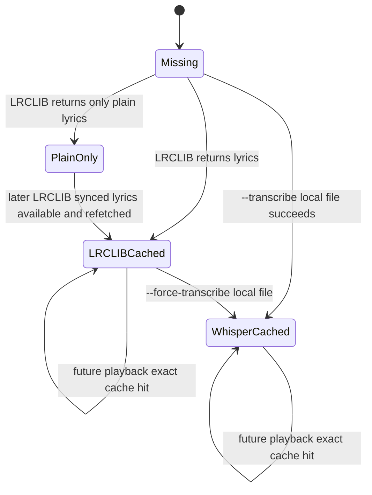

# Cache schema

Karaoke has two caches:

- an **OpenSearch** index (`tracks`, on the kind cluster) for search + rich cache, documented here;
- a **local SQLite** cache (cluster-independent) for offline lyrics + stats, documented in
  [Local cache and stats](local-cache-and-stats.md).

This page covers the OpenSearch index, used for both search and lyrics cache entries.

The same schema supports:

- local library tracks scanned from disk;
- Spotify metadata-only imports;
- write-through lyrics cache entries created while playing a requested track.

## Index settings

`osclient.ensure_index()` creates the index when it is missing.

```json
{
  "settings": {
    "index": {
      "knn": true,
      "number_of_replicas": 0
    }
  }
}
```

`number_of_replicas: 0` is intentional for a single-node local OpenSearch cluster. Without it, the cluster remains yellow because the replica shard cannot be assigned.

## Mapping

```json
{
  "properties": {
    "path": {"type": "keyword"},
    "title": {"type": "text", "fields": {"keyword": {"type": "keyword"}}},
    "artist": {"type": "text", "fields": {"keyword": {"type": "keyword"}}},
    "album": {"type": "text", "fields": {"keyword": {"type": "keyword"}}},
    "year": {"type": "integer"},
    "duration": {"type": "float"},
    "source": {"type": "keyword"},
    "has_synced": {"type": "boolean"},
    "lyrics_source": {"type": "keyword"},
    "plain_lyrics": {"type": "text"},
    "synced_lyrics": {"type": "text"},
    "indexed_at": {"type": "date"},
    "lyrics_vector": {
      "type": "knn_vector",
      "dimension": 384,
      "method": {
        "name": "hnsw",
        "space_type": "cosinesimil",
        "engine": "lucene"
      }
    }
  }
}
```

## Document types and ids

| Type | Producer | `_id` convention | `source` | Purpose |
| --- | --- | --- | --- | --- |
| Local track | `scanner.scan()` / `music-index` | `sha1(path)` | `local` | Full library index with file path, tags, lyrics and vector. |
| Spotify track | `spotify_import.import_tracks()` | `spotify:` + `sha1(track_id)` | `spotify` | Metadata seed for saved tracks/playlists; no audio download. |
| Lyrics cache | `player.get_synced()` | `lrc:` + `sha1(artist + "\n" + title)` | `lrclib-cache` | Write-through cache for ad-hoc queried/played songs. |

## Field semantics

| Field | Meaning |
| --- | --- |
| `path` | Local filesystem path or Spotify URI. Lyrics-cache documents may omit it. |
| `title`, `artist`, `album` | Human metadata used by lookup and display. |
| `duration` | Track duration in seconds when known. LRCLIB matching uses rounded seconds. |
| `source` | Document producer: `local`, `spotify`, or `lrclib-cache`. |
| `lyrics_source` | Lyrics origin: `lrclib`, `whisper`, or `none`. |
| `has_synced` | True when `synced_lyrics` parsed into at least one timestamped line. |
| `plain_lyrics` | Plain lyric text for display fallback and semantic embedding. |
| `synced_lyrics` | Raw LRC text cached verbatim. |
| `lyrics_vector` | 384-d normalized embedding of lyrics, or metadata fallback when lyrics are absent. |
| `indexed_at` | UTC ISO timestamp for last upsert/write-through. |

## Cache lookup rules

Lyrics playback uses `search.find_track()`, not the semantic search endpoint.

`find_track()` performs:

1. `match_phrase` on title;
2. `match_phrase` on artist when an artist is known;
3. a case-insensitive exact equality guard on returned title/artist.

This avoids a real bug where fuzzy search returned a different track and therefore wrong lyrics.

## Cache lifecycle



## Operational notes

- OpenSearch kNN is bundled in OpenSearch 3.8+; do not set the removed `knn.plugin.enabled` setting.
- The index dimension must match `EMBED_DIM` and the embedding model. The default model is `all-MiniLM-L6-v2`, which emits 384 dimensions.
- The cache is best-effort. If OpenSearch is down, playback falls through to LRCLIB/Whisper without failing the whole CLI.
- Write-through lyrics cache entries do not currently include vectors; library scans and Spotify imports are the paths that populate semantic search vectors.
