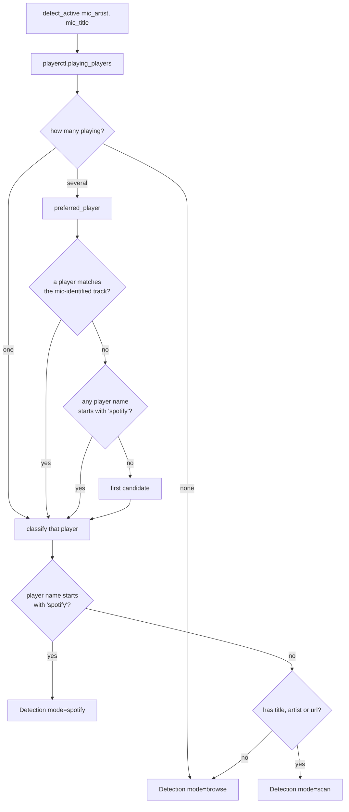
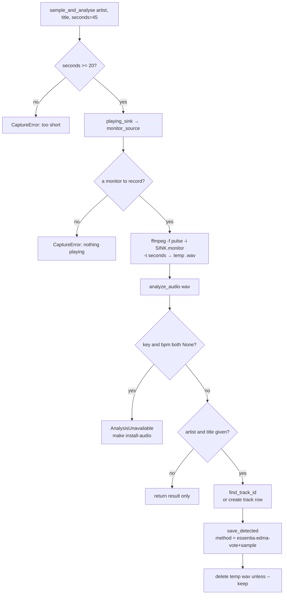
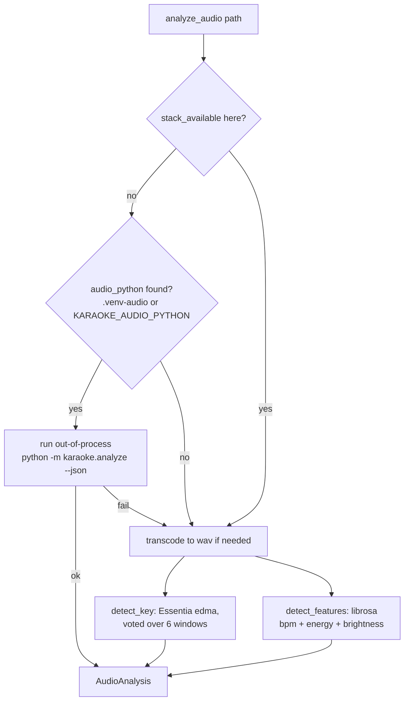
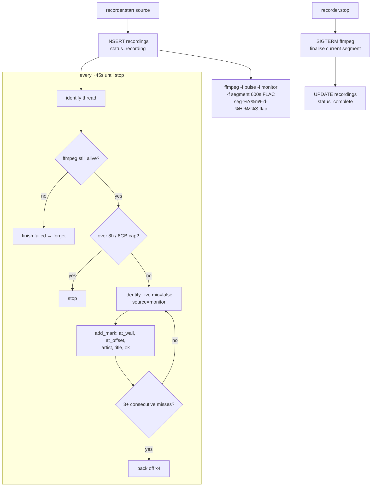
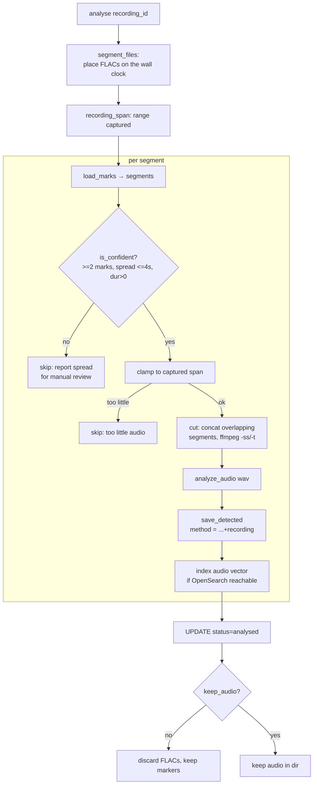

# Flows

Schemas for the runtime flows the TUI drives. Each is a small pipeline of pure
functions over external inputs (MPRIS, PipeWire, songrec, ffmpeg), kept
side-effect-light so the arithmetic can be tested without audio.

- [Detection flow](#detection-flow) — pick the active player and the karaoke mode.
- [Sample flow](#sample-flow) — key/BPM for one track by recording what plays.
- [Record flow](#record-flow) — unattended capture + marking, then offline decompile.

Related: the [Architecture](architecture.md) page covers the lyric-lookup and
ingest flows; the per-mode pages under [Modes](modes/index.md) describe how each
of these is triggered and what the user sees.

## Detection flow

Every 1.5s the TUI asks the desktop what is playing and maps it to a mode. The
mic hints (`mic_artist`/`mic_title`) only ever break a tie between several
players that are *all* playing; they never invent a detection.

`detect.detect_active()` → `preferred_player()` → `classify()` → `Detection`.



Why the tie-break order is fixed: without a stable rule the choice follows
playerctl's listing order and the mode flaps between players mid-song. Priority
is (1) the player whose track the microphone just identified — provably the one
making the sound in the room, (2) Spotify, which reports an exact position where
a browser tab does not, (3) whatever came first, so there is always an answer.

Chrome names its player per instance (`chromium.instance402904`), so only a
prefix comparison is stable across restarts.

### Lyric resolution for a detection

Once a mode is chosen, `detect.resolve_lyrics()` turns it into
`(artist, title, lyrics)` from the local SQLite cache, preferring the canonical
URL over the often-stale browser artist/title.

```mermaid
flowchart TD
    A[resolve_lyrics detection] --> B{detection has a url?}
    B -- yes --> C[find_track_by_url\nsources table]
    C -- hit --> Z[return cached lyrics]
    B -- no / miss --> D{artist or title?}
    D -- no --> Y[return None]
    D -- yes --> E[find_track_id exact]
    E -- hit --> Z
    E -- miss --> F[retry with clean_title\ndrop '(Remastered)' etc.]
    F -- hit --> Z
    F -- miss --> G[find_track_id_relaxed\nfull credit / decorated title]
    G -- hit --> Z
    G -- miss --> H{empty artist\nbut have title?}
    H -- yes --> I[title-only lookup\nprefer rows with synced lyrics]
    I -- hit --> Z
    H -- no --> Y
```

A miss on a real `(artist, title)` is persisted by `record_gap()`: the source
(track + URL) is stored when the title is real, and a lyric gap is logged for
`karaoke-backfill` / `karaoke-stage` — but only when **both** artist and title
are known, since an artist-less row could never be matched against LRCLIB and
would sit in the queue being retried forever.

## Sample flow

`k` in the TUI (or `karaoke-sample` / `make sample`). Post-processing needs
audio; a Spotify-only track has no downloadable file, so instead the sink
**monitor** is recorded in real time — a clean digital copy of exactly what is
playing, no microphone and no room noise. Capture is real time: 45s of audio
takes 45s, which is why it runs for the one track in front of you rather than
over a backlog.

`sample_audio.sample_and_analyse()` → `capture()` → `analyse_sample()` →
`analyze.analyze_audio()` → `track_analysis.save_detected()`.



The `+sample` method suffix marks the analysis as excerpt-derived wherever it is
displayed, so a sampled result is never mistaken for a full-track one. Key is a
global property and survives excerpting well; tempo is reliable for steady
material and less so where the track changes tempo.

`playing_sink()` is deliberately *not* the default sink: with a Bluetooth
speaker paired alongside built-in speakers, the default is regularly not where
the music is routed, so the sink actually carrying a stream wins.

### What `analyze_audio` does

The key/tempo analyzer degrades gracefully and delegates when the heavy DSP
stack (essentia, librosa) is not in the current interpreter.



Key detection votes across the full track plus several windows (intro, ~35%,
~70%, seeded random slices). The **windows are authoritative** — the full-track
read is kept only for reporting and the no-window fallback, because on the
benchmark it is wrong on ~half the tracks and must never override a window
consensus.

## Record flow

`O` in the TUI (or the `karaoke-recording` / `make recordings` family). The
unattended version of sampling: leave it running for an evening and it captures
everything coming out of the speakers while, in parallel, asking songrec every
so often what is playing. The recording is a means to metadata, not a library —
the audio is discarded once analysed unless `keep_audio` is set.

Two independent readers of the same monitor is fine (PipeWire allows it), so
ffmpeg and songrec do not contend, and the monitor is a different device from
the microphone, so record mode composes with radio mode rather than fighting it
for an input.

### Capture

`recorder.start()` spawns a segmenting ffmpeg and an identification thread.



Segments are named for the wall-clock instant they were opened (`-strftime`),
so the timeline survives a crash: audio can be located from a marker with no
extra bookkeeping and with no dependence on the recorder still running. ffmpeg
gets SIGTERM, not SIGKILL, so it finalises the FLAC it is writing rather than
leaving it headerless and losing the tail.

Failed identifications are stored, not dropped: a gap in the markers is evidence
about the recording (silence, speech, an unknown track) and discarding it would
make the timeline look continuous when it is not.

### Decompile

`recording_worker.analyse()` turns markers back into tracks and analyses each
confident one at full speed. The marker maths lives in
`recording_slice` as pure functions over markers, testable without any audio.

The key move: a marker doesn't merely name a track, it *dates* it —
`start_wall = at_wall - at_offset`. Every marker of the same track yields an
independent estimate of when it began, and those should agree. Agreement is
confirmation; disagreement means the track changed, repeated, was seeked, or
songrec matched a different release — so wide-spread segments are gated out of
automatic analysis.



`group_marks()` splits markers into consecutive runs of the same track; a failed
identification **ends** a run rather than being skipped over, because silence or
an unrecognised track between two matches of the same song is real evidence they
are two separate plays. `segment_from()` takes the **median** of the per-marker
start estimates, never the mean, so a single bad match cannot drag the boundary.

Segment start times are on the *track's* timeline, so a song identified partway
through is dated from before the recording began — slices are therefore clamped
to the span actually captured, and a segment with too little audio left after
clamping is skipped rather than analysed from a fragment. Audio also routinely
straddles two 10-minute FLAC files, so overlapping segments are concatenated
before the cut.

The `+recording` method suffix marks the analysis as recording-derived, so it is
never mistaken for one done on a downloaded master.
