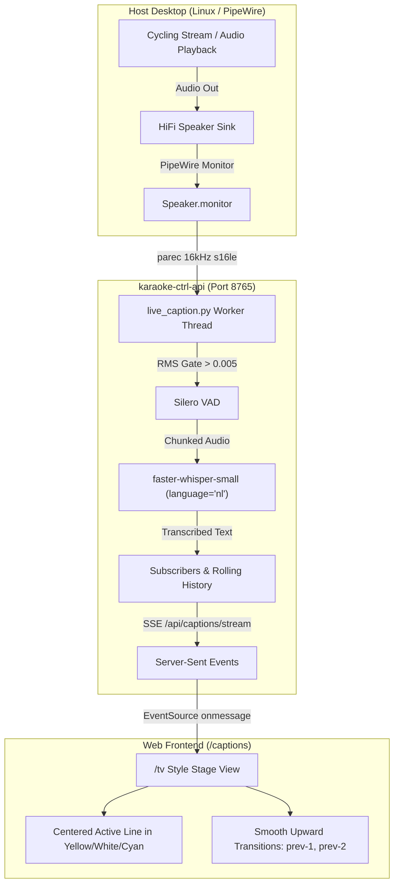

# Live Dutch Auto-Captions (Wielrennen & Desktop Audio)

The **Live Auto-Captions** feature provides real-time Dutch speech-to-text transcription directly from desktop speaker playback (e.g. live cycling commentary / koers, sports broadcasts, TV, podcasts) and displays broadcast-style subtitles styled after the Karaoke `/tv` stage view.

Accessible at: **`http://localhost:8765/captions`**

---

## Architecture & How It Works



---

## Technical Breakdown

### 1. Zero-Config Desktop & Microphone Audio Capture (PipeWire)
By default, the system captures audio from the default PipeWire microphone source (`pactl get-default-source`), or desktop speaker monitor if configured:
- Source identified automatically via `pactl get-default-source` (microphone) or `pactl get-default-sink` (speaker monitor).
- Configurable via `KARAOKE_CAPTION_SOURCE` environment variable (`mic`, `speaker`, or custom device ID).
- Captured in real-time via `/usr/bin/parec` at **16 kHz, 16-bit mono PCM**.
- The worker runs inside `src/karaoke/live_caption.py` in a background daemon thread (`dutch-caption-worker`).

### 2. Fast Energy & VAD Gating
To keep CPU usage minimal and avoid transcribing silent moments or ambient room background noise:
- A root-mean-square (**RMS**) gate checks each 3-second audio buffer. If RMS < 0.005 (near silence), the chunk is discarded without running the neural model.
- Active chunks are passed through **Silero VAD** inside Faster-Whisper to trim non-speech audio (crowd cheering, bicycle chain noise, race motorbikes).

### 3. Faster-Whisper Local Inference
- Uses the locally cached **`faster-whisper-small`** model (located in `~/.cache/huggingface/hub/models--Systran--faster-whisper-small`).
- Configured specifically for Dutch commentary:
  - `language="nl"`
  - `beam_size=3`
  - `temperature=0.0`
- Runs entirely on-device with zero external API calls or latency.

### 4. Real-Time SSE Distribution (`/api/captions/stream`)
- Clients connect over standard **Server-Sent Events** (`EventSource('/api/captions/stream')`).
- The worker starts automatically on-demand when the first client connects.
- Keeps an in-memory rolling history of the last 30 sentences so refreshing or opening a new tab immediately shows recent context.

### 5. `/tv` Style Centered Stage Frontend
Unlike a plain terminal feed or bottom-scrolling chat box that scrolls off the bottom of the screen, the `/captions` page uses the layout principles of the Karaoke `/tv` stage:
- **Anchored Center**: The current live sentence (`line-active`) is anchored dead-center on the screen in large, high-contrast, glowing typography (default `3.4rem`, font-weight `900`).
- **Smooth Upward Transition**: As new commentary arrives, older lines smoothly slide upward with cubic-bezier CSS animations:
  - `line-active` (large glowing current sentence, 100% opacity)
  - `line-prev-1` (previous sentence, medium size, 70% opacity)
  - `line-prev-2` (older sentence, small, 35% opacity)
- **High-Contrast Teletext Themes**:
  - Teletext Broadcast Yellow (`#ffd700`)
  - Crisp High-Contrast White (`#ffffff`)
  - Electric Cyan (`#00f2fe`)
- **Responsive Controls**:
  - `[F]` or button: Toggle Fullscreen mode.
  - `A-` / `A+`: Scale text size from 1.8rem to 5.0rem to fit beside any video window or PiP.

---

## Endpoints

| Method | Endpoint | Description |
|---|---|---|
| `GET` | `/captions` | Full-screen broadcast auto-caption display page |
| `GET` | `/api/captions/stream` | Real-time Server-Sent Events (SSE) subtitle stream |

---

## Service Management

The feature is hosted directly within `karaoke-ctrl-api.service`:

```bash
# Check service status
systemctl --user status karaoke-ctrl-api.service

# Restart service after code updates
systemctl --user restart karaoke-ctrl-api.service

# Inspect live audio process
ps aux | grep parec
```
