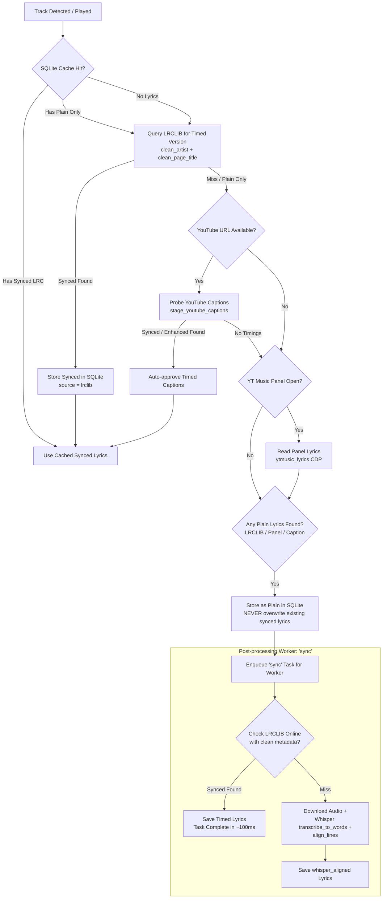

# Implementation Plan: Lyrics Detection Waterfall & Timed Version Priority

This plan investigates and fixes the lyrics detection waterfall bug where finding untimed lyrics in YouTube / YouTube Music (e.g. via the CDP lyrics panel or untimed captions) causes the system to settle for plain text, overwrite existing synced lyrics, and schedule heavy Whisper audio alignment when real synced lyrics exist online.

---

## Goal Description

When playing a song from YouTube or YouTube Music:
1. **The Bug**:
   - The TUI receives noisy browser metadata (e.g., `artist = "Kavinsky - Topic"`, `title = "Nightcall (Official Video)"`).
   - `fetch_lrclib` misses because it only stripped live/remaster suffixes (`clean_title`) without stripping YouTube page decorations (`clean_page_title`: `(Official Video)`) or YouTube artist decorations (`clean_artist`: `- Topic`).
   - The TUI falls back to reading YouTube Music's CDP lyrics panel (`_panel_lyrics`), which returns **untimed plain text** from LyricFind.
   - `localcache.add_track_and_lyrics` unconditionally deletes existing approved lyrics (`DELETE FROM lyrics WHERE track_id = ? AND kind = 'approved'`), **wiping out any synced lyrics** that radio mode (`-r`) or an earlier fetch had already cached.
   - `player.get_synced()` treats any cached plain lyrics as a cache hit (`cached.synced_raw or cached.plain`) and aborts checking LRCLIB.
   - The TUI is left displaying `"unsynced"` ("only saw the plain text") and enqueues the track for Whisper alignment ("next step is align text").
2. **The Fix**:
   - **Enforce Timed Priority in Cache**: Never overwrite or downgrade approved synced lyrics with untimed plain lyrics in `add_track_and_lyrics()`.
   - **Check Online Timed Version First**: If cache only holds plain lyrics, `get_synced()` and `_background_fetch_lyrics()` must check online (LRCLIB) for a timed version before settling for plain text.
   - **Check Online Before Whisper Alignment**: When the post-processing worker receives a `"sync"` task for plain lyrics, it must first check online for timed lyrics before downloading the full audio and running Whisper transcription.
   - **Full YouTube Metadata Normalization**: In `fetch_lrclib()` and `_background_fetch_lyrics()`, normalize artist (`clean_artist`) and title (`clean_page_title` + `clean_title`), and search for synced lyrics in `/api/search` if `/api/get` only returns plain text.

---

## User Review Required

> [!IMPORTANT]
> **No-Downgrade Cache Rule**:
> If a track in SQLite already has approved `synced_lyrics`, incoming untimed lyrics from YouTube panel or plain captions will **never overwrite or erase** the timestamps. If the incoming payload has plain text and the existing row has empty plain text, plain text is populated while preserving the synced timestamps.

> [!IMPORTANT]
> **Online Check Before Whisper Alignment**:
> In `postprocess_worker.run_sync_logic()`, when a track has plain lyrics and needs synchronization, the worker will query LRCLIB with cleaned artist/title. If LRCLIB returns timed lyrics, it writes them as `approved` and finishes in ~100ms without downloading audio or burning CPU/GPU on Whisper. Whisper alignment remains the fallback when no online timings exist.

---

## Proposed Architecture: The Find Lyrics Waterfall



---

## Proposed Changes

### Component 1: LRCLIB Client & Title/Artist Normalization (`src/karaoke/lyrics.py`)

#### [MODIFY] [`src/karaoke/lyrics.py`](file:///home/tina/karaoke/src/karaoke/lyrics.py)

1. **Don't Stop on Plain-Only `/api/get`**:
   In `fetch_lrclib()`, if `/api/get` returns HTTP 200 with `plainLyrics` but `syncedLyrics` is empty:
   Save the plain lyrics as a candidate fallback, but continue to query `/api/search` to check if another entry has `syncedLyrics`.
2. **Support Full Cleaning in `fetch_lrclib()`**:
   Generate candidate pairs combining:
   - `artist` and `clean_artist(artist)`
   - `title`, `clean_page_title(title)`, `clean_title(title)`, and `clean_title(clean_page_title(title))`
3. **Always Prefer Synced**:
   If any candidate yields `syncedLyrics`, return it immediately. Only return plain lyrics if all candidates fail to yield synced lyrics.

```python
def fetch_lrclib(
    artist: str,
    title: str,
    album: Optional[str] = None,
    duration: Optional[float] = None,
    *,
    timeout: float = 10.0,
    session: Optional[Any] = None,
) -> Lyrics:
    # Build candidate pairs
    artists = [artist]
    c_art = clean_artist(artist)
    if c_art and c_art != artist:
        artists.append(c_art)

    raw_titles = [title]
    page_cleaned = clean_page_title(title)
    if page_cleaned and page_cleaned not in raw_titles:
        raw_titles.append(page_cleaned)

    titles = []
    for rt in raw_titles:
        if rt not in titles:
            titles.append(rt)
        ct = clean_title(rt)
        if ct and ct not in titles:
            titles.append(ct)

    plain_fallback = Lyrics()
    for a in artists:
        for t in titles:
            # 1. Try /api/get
            ...
            if r.status_code == 200:
                ly = _to_lyrics(r.json())
                if ly.has_synced:
                    return ly
                if ly.plain and not plain_fallback.plain:
                    plain_fallback = ly

            # 2. Try /api/search
            ...
            if r.status_code == 200:
                results = r.json() or []
                synced_hit = next((x for x in results if x.get("syncedLyrics")), None)
                if synced_hit:
                    return _to_lyrics(synced_hit)
                if results and not plain_fallback.plain:
                    plain_fallback = _to_lyrics(results[0])

    return plain_fallback
```

---

### Component 2: Non-Downgrading Storage (`src/karaoke/localcache.py`)

#### [MODIFY] [`src/karaoke/localcache.py`](file:///home/tina/karaoke/src/karaoke/localcache.py)

1. **Protect Approved Synced Lyrics in `add_track_and_lyrics()`**:
   Before deleting or updating `lyrics WHERE track_id = ? AND kind = 'approved'`:
   Inspect existing row:
   ```python
   cur.execute("SELECT synced_lyrics, plain_lyrics FROM lyrics WHERE track_id = ? AND kind = 'approved'", (track_id,))
   existing = cur.fetchone()
   if existing and existing["synced_lyrics"] and not lyrics.synced_raw:
       # Never downgrade: preserve existing synced_lyrics!
       # If incoming plain is non-empty and existing plain was empty, update plain only.
       if lyrics.plain and not existing["plain_lyrics"]:
           cur.execute("UPDATE lyrics SET plain_lyrics = ? WHERE track_id = ? AND kind = 'approved'", (lyrics.plain, track_id))
           c.commit()
       log.debug("add_track_and_lyrics: skipped overwriting existing synced lyrics for track %s with plain lyrics", track_id)
       return
   ```
2. If incoming `lyrics` has `synced_raw`:
   Allow the write (or upgrade from plain to synced).

---

### Component 3: Cache-First Synced Fallback (`src/karaoke/player.py`)

#### [MODIFY] [`src/karaoke/player.py`](file:///home/tina/karaoke/src/karaoke/player.py)

1. **In `get_synced()`**:
   If local cache has a record with `has_synced` -> return immediately (`cache_hit`).
   If local cache only has `plain` lyrics (`not cached.has_synced`) -> retain it as `cached_plain`, but do **not** abort!
   Query `fetch_lrclib(artist, title, album, duration)`.
   If LRCLIB returns `ly.has_synced` -> write-through to cache (`localcache.add_track_and_lyrics`) and return `ly`.
   If LRCLIB does not find synced lyrics -> use `cached_plain` (or `ly.plain`), log gap, and return.

---

### Component 4: TUI Lyric Detection & Background Fetch (`src/karaoke/tui.py`)

#### [MODIFY] [`src/karaoke/tui.py`](file:///home/tina/karaoke/src/karaoke/tui.py)

1. **Clean Artist and Title in `_background_fetch_lyrics()`**:
   - Clean decorations from `artist` and `title` using `clean_artist`, `clean_page_title`, and `clean_title`.
   - If `artist` is blank and `title` has `" - "`, split them using `parse_youtube_title`.
2. **Prioritize Synced Before Panel Scrape**:
   - Query `fetch_lrclib` across candidates. If synced lyrics are found, store them immediately and reset `_sync_key = None`.
3. **Handle Panel Scrape**:
   - If LRCLIB had no synced lyrics and `_panel_lyrics` returns plain text:
     - Store the plain lyrics via `add_track_and_lyrics` (which respects the non-downgrade rule).
     - Enqueue `"sync"` for postprocessing.

---

### Component 5: Worker Pre-Whisper Online Check (`src/karaoke/postprocess_worker.py`)

#### [MODIFY] [`src/karaoke/postprocess_worker.py`](file:///home/tina/karaoke/src/karaoke/postprocess_worker.py)

1. **In `run_sync_logic()`**:
   Before downloading audio and running Whisper:
   ```python
   # 1. Fast online check: did someone sync this online since we grabbed plain text?
   t_row = conn.execute("SELECT artist, title, album, duration FROM tracks WHERE track_id = ?", (track_id,)).fetchone()
   if t_row and t_row["artist"] and t_row["title"]:
       from .lyrics import fetch_lrclib
       online = fetch_lrclib(t_row["artist"], t_row["title"], album=t_row["album"], duration=t_row["duration"])
       if online and online.has_synced:
           localcache.add_track_and_lyrics(t_row["artist"], t_row["title"], online, conn=conn)
           log.info("postprocess: upgraded track %s to online synced lyrics without Whisper (%s)", track_id, online.source)
           return True
   ```
2. If online check misses, proceed to audio download + Whisper alignment.

---

### Component 6: Documentation (`docs/flows.md`, `docs/architecture.md`)

#### [MODIFY] [`docs/flows.md`](file:///home/tina/karaoke/docs/flows.md)
#### [MODIFY] [`docs/architecture.md`](file:///home/tina/karaoke/docs/architecture.md)

1. Update the lyrics lookup flowchart in `docs/architecture.md` and `docs/flows.md` to show the online timed check when cached lyrics lack timing, the non-downgrade guard, and the worker's pre-Whisper online check.

---

## Verification Plan

### Automated Tests

1. **LRCLIB Search Fallback & Cleaning Tests** (`tests/test_lyrics.py`):
   - Test that `/api/get` returning plain-only lyrics falls back to `/api/search` and picks a synced entry.
   - Test that `fetch_lrclib` queries with cleaned YouTube decorations (`clean_page_title` and `clean_artist`).
2. **Non-Downgrade Cache Tests** (`tests/test_localcache.py`):
   - Test that calling `add_track_and_lyrics` with plain lyrics when the track already has approved `synced_lyrics` does NOT delete or erase `synced_lyrics`.
   - Test that calling `add_track_and_lyrics` with synced lyrics when the track has plain lyrics DOES upgrade to synced.
3. **`get_synced` Plain Cache Passthrough Tests** (`tests/test_player.py`):
   - Test that when local cache has plain lyrics, `get_synced` queries LRCLIB and upgrades to synced if available.
   - Test that if LRCLIB misses, `get_synced` still returns the cached plain lyrics.
4. **Worker Pre-Whisper Online Check Tests** (`tests/test_postprocess_worker.py` / `tests/test_lyric_sync_trigger.py`):
   - Test that `run_sync_logic` checks LRCLIB first and upgrades directly without calling `transcribe_to_words`.
5. **Full Regression Suite**:
   ```bash
   pytest tests/test_lyrics.py tests/test_localcache.py tests/test_player.py tests/test_tui.py tests/test_lyric_sync_trigger.py
   pytest
   ```
6. **Documentation Verification**:
   ```bash
   python scripts/doc_sync.py --check
   .venv/bin/mkdocs build --strict
   ```

### Manual Verification
1. Open a YouTube Music track with a lyrics tab open in the browser.
2. Run `karaoke -r` in one terminal and `karaoke` (TUI) in another terminal.
3. Verify that both instances show synced lyrics with timestamps, rather than TUI being downgraded to plain text.
4. Verify that queuing a plain lyric track for postprocessing instantly finds online synced lyrics when available.
