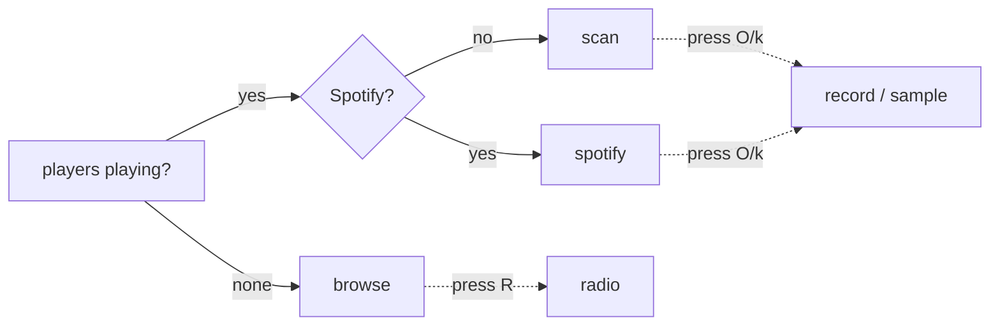

# Modes

The TUI is **player-aware**: it watches the desktop over MPRIS and picks a mode
automatically (`detect.detect_active` → see the [Detection flow](../flows.md#detection-flow)).
Three of the modes are chosen for you; the rest are things you turn on.

| Mode | How it starts | Position source | Page |
|---|---|---|---|
| [Scan](scan.md) | auto — a browser/desktop player is playing | MPRIS `position` | scan.md |
| [Spotify](spotify.md) | auto — Spotify is the active player | Spotify `progress_ms` | spotify.md |
| [Browse](browse.md) | auto — nothing is playing | none (library-driven) | browse.md |
| [Radio](radio.md) | `R` — mic identification | dead-reckoned from songrec | radio.md |
| [Record](record.md) | `O` — unattended capture | n/a (offline decompile) | record.md |
| [Sample](sample.md) | `k` — one-shot key/BPM | n/a (real-time capture) | sample.md |

Scan, Spotify and Radio are the "active" modes (`Detection.is_active`) — there
is a song to follow and sync lyrics to. Browse is the idle state. Record and
Sample are not really sync modes at all: they capture the audio coming out of
the speakers to fill in **key/BPM metadata** that has no other source, and they
compose with whatever mode is already running.

Modes never fight over devices: Scan/Spotify/Radio read MPRIS or the
microphone, while Record/Sample read the PipeWire sink **monitor** — a different
device — so you can sample or record while radio mode listens on the mic.

## Auto-selection at a glance

Press `m` to cycle the mode manually and `?` for the live key reference (it is
generated from the bindings, so it can't go stale).
