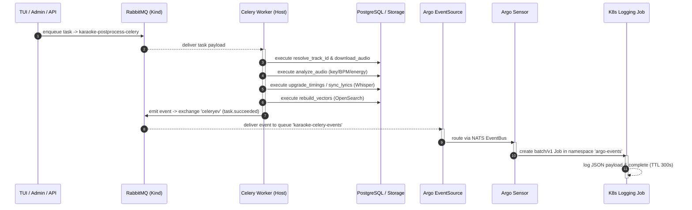

# Platform Services, Topology & Operations Schema

This document provides a comprehensive map of every service in the Karaoke platform, how they connect across the host and Kubernetes cluster, how the event-driven post-processing pipeline operates, and what controls are available directly inside the Admin Operations TUI (`make admin`).

---

## 1. End-to-End Topology Schema

The system is partitioned into four cooperating domains:

1. **Host-Side User Systemd Services**: Orchestrated by `karaoke.target`, handling APIs, media control, Celery post-processing worker, the MCP server, and monitoring.
2. **In-Cluster Services (Kubernetes: `kind-karaoke`)**: RabbitMQ message broker, OpenSearch vector search, the Obot MCP gateway, and the Argo Events workflow engine.
3. **Interactive Control Surfaces**: Terminal TUIs (`karaoke`, `karaoke-admin`), browser Web UI (`textual-serve`), and web dashboards (Flower, RabbitMQ Management).
4. **The AI Plane**: the MCP server exposing the library as tools, the DJ booth driving local Ollama, and external MCP clients reaching in either directly or through the Obot gateway.

Three edge types decide what breaks on a reboot, so they are drawn distinctly:
a **port-forward** is a host process (`karaoke-mq-forward`) and dies with it; a
**kind extraPortMapping** belongs to the cluster container; an **outbound
tunnel** is dialled from the host because Obot refuses to connect *to* a
private IP. See [What survives a reboot](#5-what-survives-a-reboot).

```mermaid
flowchart TB
    subgraph Clients["Interactive Clients & Web UIs"]
        TUI["Terminal Karaoke TUI\n(make tui / karaoke)"]
        WebTUI["Browser Web TUI\n(http://localhost:8001)\ntextual-serve"]
        AdminTUI["Admin Operations TUI\n(make admin / karaoke-admin)"]
        FlowerUI["Flower Celery Dashboard\nhttp://localhost:5555"]
        RabbitUI["RabbitMQ Management\nhttp://localhost:15672"]
        ChromeCDP["Chrome Kiosk Window\nCDP :9222 (YT Music / Spotify)"]
    end

    subgraph HostSystemd["Host Services (systemd --user / karaoke.target)"]
        CtrlAPI["karaoke-ctrl-api.service\n:8765\nPlayback & Worker Scaling API"]
        LibAPI["karaoke-api.service\n:8000\nRead-only Tracks & Lyrics API"]
        MCPSrv["karaoke-mcp.service\n:8888 /sse + /mcp\nMCP tools over SSE & Streamable HTTP"]
        Tunnel["karaoke-obot-tunnel.service\nobot tunnel (outbound)"]
        Relay["karaoke-relay.service\noutbox -> OpenSearch"]
        WebTUISvc["karaoke-webtui.service\ntextual-serve :8001"]
        Kiosk["karaoke-kiosk.service\nChrome kiosk window"]
        MQForward["karaoke-mq-forward.service\nkubectl port-forward\n5672 & 15672"]
        CeleryWorker["karaoke-celery-worker.service\nWorker Pool (concurrency=2)\nSlice: karaoke-postprocess.slice"]
        CeleryFlower["karaoke-celery-flower.service\nFlower Web Server (:5555)"]
        HealthTimer["karaoke-healthcheck.timer\n5-minute periodic sweep"]
    end

    subgraph AIPlane["AI Plane"]
        MCPClient["MCP clients\nClaude Code / Claude Desktop"]
        DJBooth["AI DJ Booth\nTUI 'D' / karaoke-dj"]
        Ollama["Ollama :11434\nqwen3 (host)"]
    end

    subgraph HostStorage["Host Storage & Media Drivers"]
        PG[("PostgreSQL 18\nkaraoke database\ntracks / lyrics / analysis / events")]
        CeleryDB[("celery-results.sqlite\nTask Result Backend")]
        YTCache["YouTube Audio Cache\n~/.local/share/karaoke/youtube"]
        MPRIS["Linux Desktop MPRIS\n(playerctl)"]
        PipeWire["PipeWire Audio Sinks\n(Sink Monitors & Mic)"]
    end

    subgraph K8sKaraoke["Kubernetes: namespace 'karaoke' & 'default'"]
        RMQ["RabbitMQ Broker Pod\nsvc/rabbitmq\nAMQP :5672 / Mgmt :15672"]
        QueueWork["Queue:\nkaraoke-postprocess-celery"]
        ExCeleryEV["Exchange (topic):\nceleryev"]
        OpenSearchPod[("OpenSearch 2.x\nopensearch-cluster-master\n:9200 (NodePort 30920)")]
        ObotGW["Obot MCP Gateway\nsvc/obot-obot :30080\naudit + access policies"]
    end

    subgraph K8sArgo["Kubernetes: namespace 'argo-events'"]
        EventBus["NATS EventBus\n(eventbus-default-stan 3-node)"]
        EventSource["AMQP EventSource\namqp-celery-eventsource\n(Queue: karaoke-celery-events)"]
        Sensor["Sensor:\ncelery-postprocess-sensor\n(filter: karaoke.tasks.*)"]
        K8sJob["Kubernetes Batch Job\nlog-celery-task-event-*"]
    end

    %% Client linkages
    TUI -->|MPRIS & CDP| ChromeCDP
    TUI -->|read lyrics/analysis| PG
    WebTUI -->|browser session| TUI
    AdminTUI -->|HTTP /api/workers/status| CtrlAPI
    AdminTUI -->|SIGTERM process| WebTUISvc
    AdminTUI -->|in-process / direct fallback| PG

    %% Host Service linkages
    CtrlAPI -->|systemctl --user /proc| CeleryWorker
    CtrlAPI -->|MPRIS & CDP| MPRIS
    LibAPI --> PG
    WebTUISvc -->|serves| WebTUI
    Kiosk --> ChromeCDP
    MQForward -.->|port-forward :5672/:15672| RMQ
    Relay -->|read outbox| PG
    Relay -->|index events| OpenSearchPod

    %% AI plane
    MCPClient -->|SSE / Streamable HTTP| MCPSrv
    MCPClient -.->|or via gateway, for audit| ObotGW
    MCPSrv -->|search, stats, playlists| PG
    MCPSrv -->|sounds-like / CLAP| OpenSearchPod
    MCPSrv -->|play_track| MPRIS
    DJBooth -->|in-process tools| MCPSrv
    DJBooth -->|chat completions| Ollama
    TUI -->|D opens| DJBooth
    Tunnel ==>|outbound, authenticated| ObotGW
    ObotGW ==>|proxied back through tunnel| MCPSrv

    %% Celery linkages
    CeleryWorker -->|AMQP localhost:5672| MQForward
    CeleryFlower -->|AMQP localhost:5672| MQForward
    CeleryWorker -->|read/write metadata| PG
    CeleryWorker -->|audio downloads| YTCache
    CeleryWorker -->|persist task states| CeleryDB
    CeleryWorker -->|rebuild vectors| OpenSearchPod

    %% Event pipeline linkages
    RMQ --> QueueWork
    QueueWork -->|consume tasks| CeleryWorker
    CeleryWorker -->|emit task.succeeded| ExCeleryEV
    ExCeleryEV -->|topic binding| EventSource
    EventSource -->|publish event| EventBus
    EventBus -->|dispatch| Sensor
    Sensor -->|trigger| K8sJob
```



---

## 2. Running Services Directory & Access Links

Every live service, its bound address, health check, and authentication details:

| Service | Address / URL | Transport | Host / Namespace | Description |
|---|---|---|---|---|
| **Control API** | `http://127.0.0.1:8765` | HTTP / REST | Host (`systemd`) | Playback control, active play sessions, worker scaling, logs |
| **Library API** | `http://127.0.0.1:8000` | HTTP / REST | Host (`systemd`) | Fast read-only track queries, lyrics search, and stats |
| **Flower Dashboard** | [http://127.0.0.1:5555](http://127.0.0.1:5555) | HTTP / Web UI | Host (`systemd`) | Live Celery worker inspection, task rates, args, runtime graphs |
| **RabbitMQ Mgmt** | [http://127.0.0.1:15672](http://127.0.0.1:15672) | HTTP / Web UI | Host / K8s tunnel | RabbitMQ web interface (`guest` / `guest`) |
| **RabbitMQ AMQP** | `amqp://127.0.0.1:5672` | AMQP 0-9-1 | Host / K8s tunnel | Core broker connection for Celery worker & publisher |
| **OpenSearch REST** | `http://127.0.0.1:9200` | HTTP / REST | K8s (`default`) | Vector search indexes (`tracks`, `tracks-lines`, `tracks-notes`) |
| **Web Karaoke TUI** | [http://localhost:8001](http://localhost:8001) | HTTP / WebSockets | Host (`textual-serve`)| Interactive karaoke player rendered in the web browser |
| **Chrome CDP** | `http://127.0.0.1:9222` | HTTP / WebSocket | Host (`google-chrome`) | DevTools automation port for YouTube Music & Spotify playback |
| **MCP Server** | `http://127.0.0.1:8888` | SSE + Streamable HTTP | Host (`systemd`) | Library as MCP tools: search, now-playing, suggestions, lyric vibe, playlists, playback. `/health` for probes |
| **Obot Gateway** | [http://172.18.0.2:30080](http://172.18.0.2:30080) | HTTP / Web UI | K8s (`obot`) | MCP gateway: audit log and access policies in front of the MCP server. Not a chat product |
| **Ollama** | `http://127.0.0.1:11434` | HTTP / REST | Host | Local LLM behind the AI DJ booth (`qwen3`) |
| **MkDocs Live** | [http://127.0.0.1:8085](http://127.0.0.1:8085) | HTTP / HTML | Host (`make docs-live`)| Complete platform documentation site |

---

## 3. Admin TUI Control Matrix (`make admin`)

The Admin Operations TUI (`src/karaoke/admin_tui.py`) serves as the central control plane for operators. It is designed to remain fully functional even when parts of the infrastructure are degraded.

### Actions and Keybindings

| Key | Operation | Mechanism | Target / Effect |
|---|---|---|---|
| `+` | **Scale Up Worker** | `POST /api/workers/scale` (target=1) | Starts `karaoke-celery-worker.service` |
| `-` | **Scale Down Worker** | `POST /api/workers/scale` (target=0) | Stops `karaoke-celery-worker.service` |
| `R` | **Restart Workers** | Sequential stop + start | Restarts Celery post-processing workers |
| `c` | **Refresh Clients** | `ss -Htn` socket sweep + `/api/play/sessions` | Updates connected web tabs and active playback sessions |
| `X` | **Stop Web UI** | `SIGTERM` to `web_serve.py` processes | Cleanly closes WebSockets for open browser tabs |
| `b` | **Audio Backfill** | Subprocess via `ProcessLock("admin_pipeline")` | Runs `scripts/fill_analysis_and_vector_gaps.py` |
| `v` | **Rebuild Vectors** | `vector_index.rebuild_from_sqlite` | Rebuilds OpenSearch vector indices from the Postgres store (the function name predates the migration) |
| `a` | **Analyse Recordings** | `recording_worker.analyse` | Decompiles captured audio recordings and ingests vectors |
| `w` | **Whisper Align** | `postprocess_worker.run_sync_logic` | Forces word-level lyric alignment for specified track |
| `s` | **Folder Scan** | `POST /api/scan/folder` | Scans local music directory for fingerprinting & ingest |
| `r` | **Refresh All** | Polls status, error logs, and client sessions | Forces full status re-probe across all panels |
| `q` | **Quit** | Clean application exit | Closes the Admin TUI |

### Panel Containment and Layout

To prevent logs or error tracebacks from spilling across neighbouring controls:
- **Bounded Containers**: Every major functional area is isolated in a styled `#container` with defined padding and borders.
- **Dedicated Log Box (`#log-container`)**: The error log viewer uses a dedicated scrollable `OptionList` (`#error-list`) with `overflow-y: auto`, containing multi-line stack traces cleanly.
- **Scrollable Workspace (`#admin-workspace`)**: If the terminal height is reduced below the full height of all panels, the outer workspace activates smooth vertical scrolling without clipping or overlapping elements.

---

## 4. Review of the Event-Driven Architecture (Celery + Argo Events)

The integration between Celery and Argo Events connects host-side machine learning tasks to cloud-native workflows:

### Design Principles

1. **Zero Contention for Work**: Argo Events does **not** listen on the task queue (`karaoke-postprocess-celery`). Only `karaoke-celery-worker.service` consumes tasks.
2. **Dedicated Event Mirroring**: Celery workers are launched with `--events` and configured with:
   - `worker_send_task_events = True`
   - `task_send_sent_event = True`
   - `task_track_started = True`
   This instructs Celery to broadcast lifecycle notifications to the `celeryev` topic exchange in RabbitMQ.
3. **Dedicated AMQP EventSource Queue**: The Argo Events `amqp-celery-eventsource` creates its own durable queue (`karaoke-celery-events`) bound to `celeryev` with routing key `task.succeeded`. This guarantees that event delivery is independent of worker consumption.
4. **NATS EventBus Backplane**: Events from the EventSource are published to the 3-node NATS Streaming EventBus (`eventbus-default-stan-0..2`).
5. **Sensor Filtering & Job Execution**: The `celery-postprocess-sensor` listens on the EventBus, verifies that `body.name` matches `karaoke.tasks.*`, and instantiates a lightweight Kubernetes Batch Job (`log-celery-task-event-*`) with a 300s TTL.

### Task Processing & Event Lifecycle Sequence



---

## 5. What survives a reboot

Nothing here is started by hand, but the layers come back through four
different mechanisms, and a gap in any one is invisible until the machine
restarts mid-set.

| layer | what brings it back | verify |
|---|---|---|
| Host user services | `Linger=yes` for the user, plus `karaoke.target` enabled into `default.target.wants` | `systemctl --user list-units 'karaoke*'` |
| PostgreSQL | `postgresql-18.service` (system, enabled) | `systemctl is-enabled postgresql-18` |
| kind cluster | `docker.service` (enabled) + container restart policy `unless-stopped` | `docker inspect -f '{{.HostConfig.RestartPolicy.Name}}' karaoke-control-plane` |
| OpenSearch · RabbitMQ · Obot | inside the cluster — they return with it, not separately | `kubectl get pods -A` |
| Ollama | `ollama.service` (system) | `systemctl is-enabled ollama` |
| Everything at once | — | `python scripts/healthcheck.py` |

**Lingering is the setting that decides all of it.** User units normally stop
at logout and do not start until the next login; `loginctl enable-linger tina`
is what makes `karaoke.target` come up on a headless boot. Check it with
`loginctl show-user tina -p Linger`.

**The cluster restart policy is the one that bites.** kind creates its
container with `on-failure` and `MaximumRetryCount=1`, which is not a restart
guarantee — and OpenSearch, RabbitMQ and Obot all live inside it, so the whole
in-cluster half of the diagram depends on that single container returning:

```bash
docker update --restart unless-stopped karaoke-control-plane
```

**Ordering is deliberately not enforced.** Host user units cannot order
themselves after system services like PostgreSQL, or after Docker. Rather than
fight that, every unit uses `Restart=` and retries: a service that starts
before its dependency fails its first connect and comes back. The health check
tolerates the same window, retrying the whole sweep (`KARAOKE_HEALTH_RETRIES`,
default 6 × 5s) before reporting `DEGRADED`.

---

## 6. Verification & Health Commands

Use these commands to verify that every layer of the platform is operating correctly:

### Host Services & Systemd

```bash
# Check status of all karaoke user units
systemctl --user status 'karaoke*'

# View recent unified logs across all platform units
journalctl --user -u 'karaoke-*' --since '10 min ago' --no-pager

# Run the platform health probe
make health
```

### Celery & Flower Monitoring

```bash
# Check if Celery worker is receiving tasks
celery -A karaoke.celery_app:app inspect active

# Check registered Celery tasks
celery -A karaoke.celery_app:app inspect registered

# Check Flower web dashboard
curl -fsS http://localhost:5555/api/workers
```

### Argo Events in Kubernetes

```bash
# Verify EventBus, EventSource, and Sensor pods are Running
kubectl --context kind-karaoke -n argo-events get pods,eventsource,sensor

# Inspect recent event-triggered Jobs
kubectl --context kind-karaoke -n argo-events get jobs

# View the log output from the latest triggered event Job
kubectl --context kind-karaoke -n argo-events logs -l events.argoproj.io/sensor-name=celery-postprocess-sensor --tail=50
```

### Synthetic Event Smoke Test

Publish a synthetic task completion event without enqueueing heavy audio work:

```bash
kubectl --context kind-karaoke -n karaoke exec deploy/rabbitmq -- \
  rabbitmqadmin publish exchange=celeryev routing_key=task.succeeded \
  payload='{"name":"karaoke.tasks.event_smoke","uuid":"test-manual-event","state":"SUCCESS"}'

# Verify that the Argo Sensor picked up the event and spawned a Job
kubectl --context kind-karaoke -n argo-events get jobs --sort-by=.metadata.creationTimestamp | tail -n 3
```
