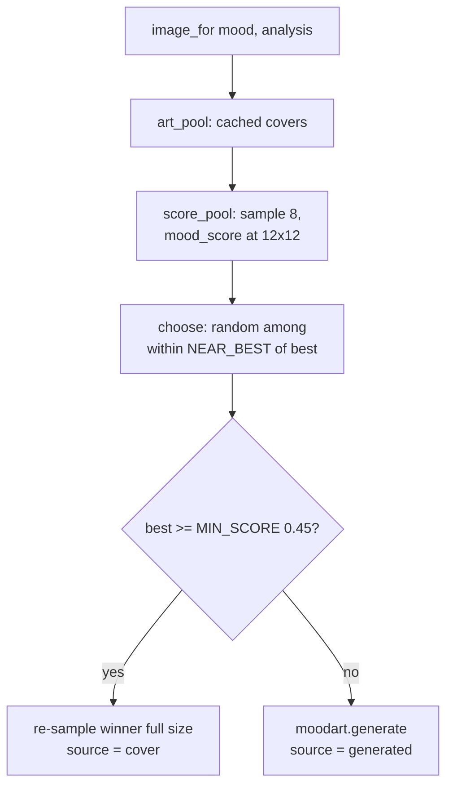

# TUI visuals

What today's work put in the TUI's right-hand `#visuals` column, and how it is
computed. Everything here is a **creative vibe cue**, not real affect analysis
or a substitute for the track's actual key/BPM read-out beside it.

The panel is rebuilt by `KaraokeTui._render_visuals()` on every lyric tick, from
two inputs: the visible lyric text (for sentiment) and the track's stored
analysis (for BPM). It stacks four things:

```
┌─ visuals ────────────┐
│  <mood image>        │  ← moodframe: a cover that matches the feeling, or computed art
│  key: F major        │
│  bpm: 129            │
│                      │
│  sentiment arc       │
│  ▲▲·▽▽·♥·▲▲·▽·...     │  ← per-line moods, down-sampled
│                      │
│  happy   █████░░░░    │  ← mood-share bars
│  tender  ██░░░░░░░    │
│  sad     █░░░░░░░░    │
│  angry   ░░░░░░░░░    │
│                      │
│  rhythm              │
│  ·······●········    │  ← rhythm_bar: pulse that reverses at each end
│  ················    │     and hops on the beat, + "129 bpm"
│                      │
│       __\            │  ← cartwheel_frame: rolls with the beat,
│     ___\o            │     turns back at the ends, hops on the beat
│     /)  |            │
└──────────────────────┘
```

## Mood imagery (`moodart` + `moodframe`)

The mood square used to spend eight rows saying one word. It now shows a
*picture* of the current feeling, drawn as coloured terminal cells.

`moodframe.image_for(mood, analysis, cols, rows)` returns `(pixels, source)`:

1. **Pick from the cover-art pool.** A random subset (`POOL_SAMPLE = 8`) of every
   cover ever cached is scored against the mood at a tiny 12×12 resolution, and
   the winner is chosen randomly from everything within `NEAR_BEST` of the top
   score — so the same song doesn't show the same cover every time. The pool is
   *all* cached covers, not the current track's own: the panel shows a feeling,
   and the track's own artwork already appears in the sidebar.
2. **Fall back to computed art.** If nothing cached beats `MIN_SCORE = 0.45`,
   `moodart.generate()` computes an image from the track's own analysis. This is
   the normal case for a Spotify-only track that never had artwork downloaded.

The provenance (`"cover"` vs `"generated"`) is returned so the panel never
silently claims computed art is a real cover.

### Scoring a cover against a mood

`moodart.mood_score()` reduces an image to mean hue / saturation / value /
contrast and compares to a per-mood `MoodTarget`. Two colour subtleties are
handled explicitly:

- **Hue is circular.** Red sits at 0.0 and 1.0, so both distance and averaging
  wrap — the mean hue is taken as a vector on the colour wheel, because
  arithmetically averaging red at 0.02 and red at 0.98 gives cyan.
- **Grey has no hue.** Hues are saturation-weighted when averaged, so a
  black-and-white cover doesn't vote as loudly as a vivid one, and the hue term
  counts for less when there's barely any colour to judge.



### Computed art

`moodart.generate()` is deterministic for a given track, so the panel does not
shimmer between refreshes — the variety comes from tracks differing, not from
randomness. It derives everything from the SQLite analysis row (always present
for an analysed track, needs no cluster):

- **Key → hue.** The twelve pitch classes are laid around the colour wheel
  (`_SEMITONE_HUE = 1/12`), so neighbouring keys get neighbouring colours.
- **Minor → darker, less saturated**, matching how minor keys are heard and
  keeping major/minor visibly distinct.
- **Energy → saturation, brightness → value.**
- **Tempo → spatial frequency:** a fast track gets a busier field (kept within
  ~1–4 cycles across the panel, so it stays a pattern rather than noise).

## Sentiment (`visuals`)

`visuals.analyze_sentiment(text)` aggregates the per-line moods of the visible
lyric block (using the lexicon in `sentiment`) into a `SentimentProfile`:
per-mood counts, a dominant mood, and the ordered list of line moods.

- **`sentiment_arc(profile)`** — one line of per-line mood glyphs
  (`▲` happy, `▽` sad, `✷` angry, `♥` tender, `·` neutral), down-sampled to a
  fixed width.
- **`sentiment_bars(profile)`** — a small horizontal bar chart of mood shares.

!!! warning "Ambiguous-width glyphs"
    The mood marks are East-Asian **ambiguous** width: terminals disagree about
    whether they take one cell or two, and font fallback can differ per glyph.
    One report drew `▽` wide while `▲ ♥ ✷` stayed narrow, pushing only the "sad"
    bar a column right. Nothing can measure that reliably (`rich.cells.cell_len`
    reports 1 for all four), so `sentiment_bars` puts **nothing mis-measurable
    before the bar** — label then bar, all ASCII to the left of it — and every
    bar starts in the same column on every terminal. The marks still appear in
    `sentiment_arc`, where a shift is harmless. `visuals.cell_width()` /
    `pad_cells()` handle width where alignment does matter.

## Rhythm bar (`visuals.rhythm_bar`)

An animated metronome driven by BPM and elapsed time. Two rows: the pulse
travels left and right and **reverses at each end** rather than wrapping — a
sawtooth that teleports back to the start reads as drift and the eye follows the
jump instead of the beat. On each beat the pulse is drawn on the upper row and
lands on the lower one between beats; the horizontal travel is what a metronome
lacks, the hop is what actually marks time.

- Triangle wave over `BOUNCE_BEATS = 2.0` for the traverse; `HOP_FRACTION = 0.35`
  of each beat spent airborne, so the hop reads as a strike, not hovering.
- Depends only on `elapsed`, so the same instant always renders identically and
  the caller's timer interval cannot introduce jitter.
- With no BPM there is no beat to keep, so it stays a single static bar.

`visuals.tempo_word(bpm)` gives the rough Italian marking (largo…presto) shown
elsewhere.

## Cartwheel (`visuals.cartwheel_frame`)

A nine-frame ASCII figure that rolls across the panel with the beat. Same two
principles as the rhythm bar, applied to a figure:

- **Turns back at each end** rather than teleporting to the start (a jump reads
  as drift), crossing over `CARTWHEEL_BEATS = 4.0` — slower than the bar's sweep
  because the figure is seven cells wide and a fast traverse smears it.
- **Hops on the beat:** it sits a row higher for the first `HOP_FRACTION` of each
  beat and lands for the rest. Total height is kept constant (the blank row moves
  from below to above), so the panel beneath never shifts as it hops.
- **Rotation reverses with travel** — a wheel rolling leftwards doesn't keep
  spinning clockwise, or it looks dragged backwards rather than rolling. One full
  rotation per beat.

## Why the lyrics can't just be bigger

A terminal draws one font at one size, so the lyrics can't be rendered larger
than the rest of the interface — see [The TUI](tui.md#making-the-lyrics-bigger).
The visuals column is the first thing hidden on a narrow terminal (and in focus
mode) precisely so it never crowds the lyrics out when space is tight.
