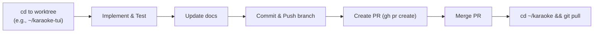

# Workflow for Karaoke

This document outlines the standard operating procedure for developing this project.

## Git Worktree Workflow

To maintain a clean and stable `main` branch, this project uses **Git worktrees** to isolate feature development. Instead of switching branches inside the main repository directory, you change directories to the corresponding worktree.

### Directory Structure

- `/home/tina/karaoke` -> Always tracks `main`. Use this for running the stable app, end-to-end testing, and pulling merged changes. Do **not** develop new features directly here.
- `/home/tina/karaoke-tui` -> Tracks `feat/tui`. Use this for developing the interactive browser and Textual UI components.
- `/home/tina/karaoke-index` -> Tracks `feat/index`. Use this for OpenSearch, vector indexing, and semantic search features.
- `/home/tina/karaoke-datamodel` -> Tracks `feat/data-model-refactor`. Use this for SQLite database schema and cache logic changes.

### Adding a New Worktree

If a new feature domain emerges, create a new worktree as a sibling directory:

```bash
cd ~/karaoke
git worktree add ../karaoke-<feature-name> -b feat/<feature-name>
```

### Standard Project Flow



## Debugging browse Enter/open behavior

Use these commands when a row appears in the TUI but Enter does not visibly open it:

```bash
cd ~/karaoke
source .venv/bin/activate
make browse
```

In another terminal:

```bash
cd ~/karaoke
make browse-log
```

The main log is `~/.local/share/karaoke/logs/karaoke.log`. Browser opener stdout/stderr are captured in:

- `~/.local/share/karaoke/logs/xdg-open.stdout.log`
- `~/.local/share/karaoke/logs/xdg-open.stderr.log`

On every Enter press, the TUI logs the selected row, artist, title, source kind, URL, and spawned `xdg-open` PID. If a cached track has no source URL, the TUI falls back to a YouTube search URL for the selected artist/title.

## Cache indexing for the TUI

Downloaded YouTube cache files are indexed into SQLite source rows with:

```bash
cd ~/karaoke
source .venv/bin/activate
make index-youtube-cache
```

This adds/updates `tracks` and `sources` only. It does not create fake empty approved lyrics rows; legacy empty placeholder rows are cleaned automatically.

## Browser cookies for better YouTube sync

YouTube increasingly requires authentication for full metadata, captions, and Premium-quality audio. You can supply your logged-in browser cookies to yt-dlp so all YouTube fetches (staging, metadata, backfill, timing upgrades) authenticate as you:

- **Globally** (recommended): set `KARAOKE_COOKIES_FROM_BROWSER` in `.env` (see `.env.example`). Every YouTube fetch then uses those cookies unless a per-call flag overrides it.
  ```bash
  # .env
  KARAOKE_COOKIES_FROM_BROWSER=firefox        # or chrome, or firefox:PROFILE
  ```
- **Per command**: pass `--cookies-from-browser firefox` (or `--cookies cookies.txt`) to `karaoke --youtube`, `karaoke-stage youtube`, etc.

The yt-dlp spec is `BROWSER[+KEYRING][:PROFILE][::CONTAINER]` (e.g. `firefox:default`, `firefox::Meta`). This unlocks higher-bitrate audio, library-only/private tracks, and age-restricted videos. It does **not** read Premium's DRM-locked offline downloads. If the browser cookie DB is locked (browser running) or a PO token is required, the fetch automatically retries anonymously.

## Browse/Enter opens the browser, not Spotify

When a track has both a Spotify and a YouTube source, browse and TUI list mode deterministically prefer the **browser-openable** (YouTube/http) source so pressing Enter opens the song page in the browser rather than depending on the Spotify desktop app being the active target. Spotify URLs are only used when no web URL exists.

## Auto-loading captions in the TUI (scan mode)

When the TUI is syncing a YouTube / YouTube Music tab that has **no cached synced lyrics**, it now auto-stages the video's captions in a background worker. If the captions carry real timing (json3 `synced`/`enhanced`), they are auto-approved into the local cache and the lyric timeline reloads immediately — no manual `karaoke-stage youtube … && approve` needed. Untimed (plain) captions are left in the staging queue for manual review instead of being auto-approved. Each video is attempted only once per session, and the fetch respects the `KARAOKE_COOKIES_FROM_BROWSER` cookie setting.

## Lyric sync offset in scan mode

Browser MPRIS `position` runs slightly **ahead** of audible output (output/device buffering), so in scan mode lyrics tend to lead the sound (observed ~1.3s). The TUI subtracts a **sync offset** from the reported position before highlighting: `elapsed = position - offset`.

- Default offset is `1.3` seconds; override with `KARAOKE_SYNC_OFFSET` (e.g. `KARAOKE_SYNC_OFFSET=0.8`).
- Nudge live in the TUI with `,` (lyrics earlier, +0.1s) and `.` (lyrics later, -0.1s). A negative offset delays lyrics past the raw position.
- The current offset is shown on the now-playing panel's `synced lyrics · <source> · offset ±X.Xs (, / .)` line.

### Per-track saved offsets

Offsets can be persisted per track in the `track_sync_offsets` SQLite table (`track_id`, `offset_s`, `updated_at`):

- Press `S` (capital) to save the current offset for the playing track.
- When you've nudged the offset and the track changes, the TUI **asks** whether to Save or Discard the change before moving on.
- When a track starts, its saved offset is loaded automatically; tracks with no saved value use the `KARAOKE_SYNC_OFFSET` default.
- Helpers: `localcache.get_sync_offset(track_id, conn)` / `localcache.set_sync_offset(track_id, offset_s, conn)` (upsert).


### Execution Steps
1. Navigate to the appropriate worktree (`cd ~/karaoke-<feature>`).
2. Activate the shared virtual environment if necessary (`source .venv/bin/activate`). Worktree Makefile targets run Python with `PYTHONPATH=src` so they import the worktree code rather than the editable install from another checkout. For ad-hoc Python commands in a worktree, use:
   ```bash
   PYTHONPATH=src python -m pytest
   PYTHONPATH=src python -m karaoke.browse
   ```
3. Write the code and update documentation files.
4. Run tests within the worktree context.
5. Commit and push the feature branch (`git push -u origin feat/<feature>`).
6. Submit a Pull Request for review (`gh pr create`).
7. Once merged, return to the main directory (`cd ~/karaoke`), checkout main, and `git pull` to synchronize the stable environment.

---

## Dataflow, DB Gap Avoidance, and Mitigation Utilities

This section details how metadata, lyrics, and audio analysis flow through the karaoke platform, how to prevent database inconsistencies/gaps, and the mitigation scripts available to repair the database.

### 1. The Unified Lyric & Metadata Dataflow

Every track in the platform is managed through three key tables in SQLite:
* `tracks`: Stores the canonical identity (Artist, Title, Duration).
* `sources`: Maps a track to an external media URL (YouTube webpage, Spotify URI, local file path, etc.).
* `lyrics`: Stores approved synced or plain lyrics.

During active playback (Spotify, Browser YouTube tabs, VLC), the system operates on the following resolution pipeline:

1. **Active URL Lookup (Preferred):** If the player reports a source URL (e.g., Spotify Track ID, YouTube video link), the system looks up that exact URL in the `sources` table first. This is highly reliable because browser MPRIS metadata is often stale or truncated.
2. **Fuzzy Artist/Title Lookup (Fallback):** If no URL matches, the system normalizes the player-reported `artist` and `title` and queries the `tracks` table.
3. **Lyric Matching:** Once a `track_id` is resolved, the system serves its approved lyrics. If a track is found but lacks lyrics, or if no track is found at all, a "lyric gap" is logged to the `lyric_gaps` table to schedule background backfilling, and the track is queued for staging.

### 2. How to Avoid DB Gaps & Inconsistencies

Due to differences in metadata formatting between Spotify, YouTube, and lyric providers (LRCLIB, Genius), the following types of database gaps can naturally occur:
* **Duplicate Tracks:** For example, Spotify reports the artist as `"Inpatient"`, whereas a lyric search/staging saves the canonical multi-artist string `"Inpatient, Ren & Chris Webby"`. This creates two disjoint track records for the same song.
* **Orphan Tracks:** A track has approved lyrics in the database but lacks any associated external URL/kind in the `sources` table (rendering it un-openable on Enter).
* **Orphan Cache Files:** A YouTube audio file (`*.webm`) was downloaded into the local cache (`~/.local/share/karaoke/youtube/`), but the track/source record was deleted, modified, or never mapped in SQLite.

To proactively avoid and heal these gaps, follow the mitigation workflows below.

### 3. Mitigation Scripts & Self-Healing Utilities

A suite of built-in CLI commands and background scripts are available to automatically clean, heal, and backfill your local database.

#### A. Database Cleanup & Self-Healing (`scripts/db_cleanup.py`)
This central utility runs a 3-phase database cleanup and self-healing loop:
1. **Track Deduplication:** Automatically groups tracks by lowercase title and identifies duplicate records where the artist names are compatible (substrings, shared first words, or matching uploader strings). It consolidates all lyrics, sources, and track analyses into the canonical record and prunes the duplicates.
2. **Source Healing:** Scans the database for tracks that have approved lyrics but are missing entries in the `sources` table. It automatically searches YouTube for those tracks and registers their YouTube webpage URLs in SQLite.
3. **Orphan Cache File Healing:** Scans your local YouTube cache (`~/.local/share/karaoke/youtube/`) for downloaded audio files that are not mapped in your database. It calls `yt-dlp` to retrieve their titles, decodes clean metadata, adds them back to `tracks`/`sources`, and runs full key/BPM/energy/brightness analysis on the local file.

**Run the database cleanup script:**
```bash
PYTHONPATH=src .venv/bin/python scripts/db_cleanup.py
```

#### B. Automated Lyric Backfilling (`karaoke-backfill`)
Finds unresolved lyric gaps in your `lyric_gaps` table, automatically searches online lyric repositories, and stages them for approval.
* **To run backfill:**
  ```bash
  make backfill
  # or
  PYTHONPATH=src .venv/bin/python -m karaoke.backfill_runner
  ```

#### C. Upgrading Plain Lyrics to Enhanced LRC (`karaoke-upgrade-timings`)
Finds cached tracks containing plain line-level lyrics, fetches their YouTube `json3` word-level captions, and upgrades them to Enhanced LRC format in-place.
* **To run the upgrade dry-run:**
  ```bash
  make upgrade-timings-dry-run
  ```
* **To run the upgrade:**
  ```bash
  make upgrade-timings
  ```

#### D. Local Audio Analysis (`karaoke-analyze` / `scripts/analyze_all_cached.py`)
Extracts and stores key, Camelot wheel, tempo (BPM), RMS energy, and spectral brightness from a local audio file and persists them in `track_analysis`.
* **To analyze a specific local file and store it under a track:**
  ```bash
  karaoke-analyze -f /path/to/song.webm --artist "Artist Name" --title "Song Title"
  ```
* **To bulk-analyze all downloaded cache files:**
  ```bash
  make analyze
  ```

#### E. Lyric Alignment from Plain Text (`karaoke`)
Aligns any raw, plain text lyric file with a local audio file using Whisper transcription to learn/generate highly accurate synced LRC lyrics.
* **To align raw text to audio:**
  ```bash
  karaoke -f ~/.local/share/karaoke/youtube/<VIDEO_ID>.webm --force-transcribe --lyrics-file /path/to/plain_lyrics.txt
  ```


