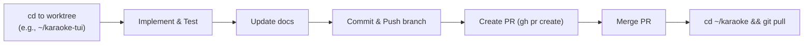

# Workflow for Karaoke

This document outlines the standard operating procedure for developing this project.

## Git Worktree Workflow

To maintain a clean and stable `main` branch, this project uses **Git worktrees** to isolate feature development. Instead of switching branches inside the main repository directory, you change directories to the corresponding worktree.

### Directory Structure

- `/home/tina/karaoke` -> Always tracks `main`. Use this for running the stable app, end-to-end testing, and pulling merged changes. Do **not** develop new features directly here.
- `/home/tina/karaoke-tui` -> Tracks `feat/tui`. Use this for developing the interactive browser and Textual UI components.
- `/home/tina/karaoke-index` -> Tracks `feat/index`. Use this for OpenSearch, vector indexing, and semantic search features.
- `/home/tina/karaoke-datamodel` -> Tracks `feat/data-model-refactor`. Use this for SQLite database schema and cache logic changes.

### Adding a New Worktree

If a new feature domain emerges, create a new worktree as a sibling directory:

```bash
cd ~/karaoke
git worktree add ../karaoke-<feature-name> -b feat/<feature-name>
```

### Standard Project Flow



### Execution Steps
1. Navigate to the appropriate worktree (`cd ~/karaoke-<feature>`).
2. Activate the shared virtual environment if necessary (`source ~/.venv/bin/activate` or use the main repo's `.venv`). Note: commands might need to point to `../karaoke/.venv/bin/python`. *Tip: You can symlink the `.venv` or configure tools to use it.*
3. Write the code and update documentation files.
4. Run tests within the worktree context.
5. Commit and push the feature branch (`git push -u origin feat/<feature>`).
6. Submit a Pull Request for review (`gh pr create`).
7. Once merged, return to the main directory (`cd ~/karaoke`), checkout main, and `git pull` to synchronize the stable environment.


