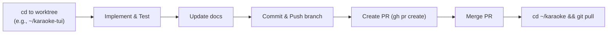

# Workflow for Karaoke

This document outlines the standard operating procedure for developing this project.

## Git Worktree Workflow

To maintain a clean and stable `main` branch, this project uses **Git worktrees** to isolate feature development. Instead of switching branches inside the main repository directory, you change directories to the corresponding worktree.

### Directory Structure

- `/home/tina/karaoke` -> Always tracks `main`. Use this for running the stable app, end-to-end testing, and pulling merged changes. Do **not** develop new features directly here.
- `/home/tina/karaoke-tui` -> Tracks `feat/tui`. Use this for developing the interactive browser and Textual UI components.
- `/home/tina/karaoke-index` -> Tracks `feat/index`. Use this for OpenSearch, vector indexing, and semantic search features.
- `/home/tina/karaoke-datamodel` -> Tracks `feat/data-model-refactor`. Use this for SQLite database schema and cache logic changes.

### Adding a New Worktree

If a new feature domain emerges, create a new worktree as a sibling directory:

```bash
cd ~/karaoke
git worktree add ../karaoke-<feature-name> -b feat/<feature-name>
```

### Standard Project Flow



## Debugging browse Enter/open behavior

Use these commands when a row appears in the TUI but Enter does not visibly open it:

```bash
cd ~/karaoke
source .venv/bin/activate
make browse
```

In another terminal:

```bash
cd ~/karaoke
make browse-log
```

The main log is `~/.local/share/karaoke/logs/karaoke.log`. Browser opener stdout/stderr are captured in:

- `~/.local/share/karaoke/logs/xdg-open.stdout.log`
- `~/.local/share/karaoke/logs/xdg-open.stderr.log`

On every Enter press, the TUI logs the selected row, artist, title, source kind, URL, and spawned `xdg-open` PID. If a cached track has no source URL, the TUI falls back to a YouTube search URL for the selected artist/title.

## Cache indexing for the TUI

Downloaded YouTube cache files are indexed into SQLite source rows with:

```bash
cd ~/karaoke
source .venv/bin/activate
make index-youtube-cache
```

This adds/updates `tracks` and `sources` only. It does not create fake empty approved lyrics rows; legacy empty placeholder rows are cleaned automatically.

### Execution Steps
1. Navigate to the appropriate worktree (`cd ~/karaoke-<feature>`).
2. Activate the shared virtual environment if necessary (`source .venv/bin/activate`). Worktree Makefile targets run Python with `PYTHONPATH=src` so they import the worktree code rather than the editable install from another checkout. For ad-hoc Python commands in a worktree, use:
   ```bash
   PYTHONPATH=src python -m pytest
   PYTHONPATH=src python -m karaoke.browse
   ```
3. Write the code and update documentation files.
4. Run tests within the worktree context.
5. Commit and push the feature branch (`git push -u origin feat/<feature>`).
6. Submit a Pull Request for review (`gh pr create`).
7. Once merged, return to the main directory (`cd ~/karaoke`), checkout main, and `git pull` to synchronize the stable environment.


