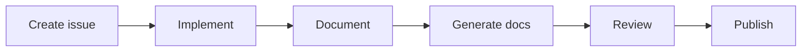

# Workflow for Karaoke

This document outlines the standard operating procedure for this infrastructure project.

### Standard Project Flow

### Execution Steps
- [ ] Open a tracking ticket.
- [ ] Write the infrastructure code.
- [ ] Update these documentation files.
- [ ] Submit a Pull Request for review.

